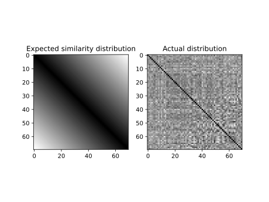
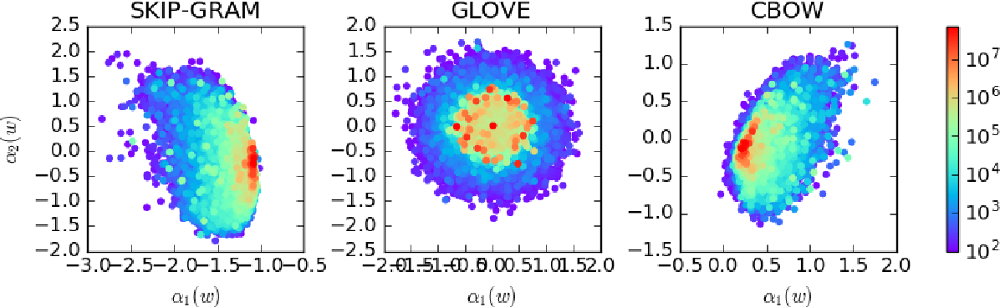
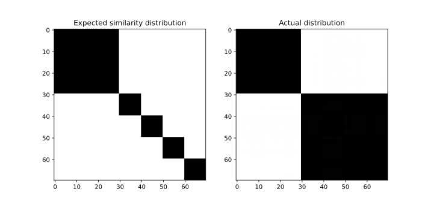

I had a discussion with Miriam Hurtado Bodell a couple of weeks back about the van Loon et al. paper "Negative Associations in Word Embeddings Predict Anti-black Bias across Regions–but Only via Name Frequency". One component argument of the paper's chain of reasoning struck us as strange: that word embeddings supposedly encode word frequency. The specific quote is

> ... terms’  positions  in  the  semantic  space  estimated  by  word embeddings tend to cluster on non-intuitive dimensions such as  term  frequency  (Mu,  Bhat,  and  Viswanath  2017;  Gong et  al.  2018)

This is not intuitively obvious, and I thought I'd investigate. The naïve-est interpretation I can think of is that term frequency should map onto a linear dimension in the word embedding space. To test this I generated a corpus consisting of 70 words, with zero word-pair correlation and with word *i* having relative probability

$$p(i) \propto {1\over 1.1^i}$$ 

(note that this distribution doesn't follow Zipf's law.)

If the naïve-est interpretation holds true, we'd expect a cosine similarity distribution similar to the left graph below. The actual result from my simulated data (trained with GloVe on 100 dimensions) doesn't seem to be in line with this expectation at all. 

A quick glance at the (Mu,  Bhat,  and  Viswanath  2017) paper indicates that the clustering is not necessarily linear in form. They present the figure below, which graphs words onto the first two principal components of the embedding space with the frequencies of the words indicated by color, for three embedding methods.

In the figure above, words of low frequency do indeed seem to cluster in small areas. For the Skipgram graph, there does seem to be a linear delineation in word frequency. For the GloVe graph, the pattern seems to be based on radial distance from the origin instead. I have no good intuition as to why this is the case. I might experiment on this later, but for now I'll satisfy myself with the fact that the frequency encoding doesn't seem to be linear in the embedding space.

## Mutually exclusive groups of words

I also sought to test a hypothesis that I came up with myself. I thought about the nature of infrequent words, and I thought that perhaps they are words relating to some (mostly) mutually exclusive and unusual domains of knowledge. I then constructed this thought experiment: 

Imagine that there is a corpus where each text belongs to one of *k* different domains. Each domain has its own unique vocabulary, but the texts also contain a lot of mutual words. The mutual words are distributed in the same way in the *k* sets of texts within the corpus. If we set *k* = 2, then it's clear that, in a word embedding model, the words for the two domains should cluster on opposite ends of an axis, and that the mutual words should be distributed orthogonally to that axis. If we set *k* = 2, then the clusters could perhaps form an equilateral triangle around the origin, and the mutual words should then be distributed orthogonally to the plane which that triangle spans. This is where things start to break apart, however; the cosine similarity for any two clusters would have to be -0.5 (barring some statistical deviation), and this would imply that the domain-unique words in two domains can cooccur. It is mathematically impossible in a euclidean space to create a polygonal shape (with more than 2 vertices) which is simultaneously equiangular and has each angle be pi radians. We thus get a strange phenomenon where words that should be mutually exclusive have greater than -1 cosine similarity, and for a sufficiently high domains-to-embedding-dimensions ratio we should even observe positive cosine similarities.

I simulated a corpus where for each text, forty mutual (i.e. not domain-specific) words were drawn randomly from a pool of thirty such words. Each text was then randomly assigned to one of four domains, and random sample of five domain-specific words drawn from a pool of 10 per domain was randomly injected within the texts. Intuitively we'd expect a cosine similarity distribution like the graph on the left, but my GloVe-models give the right graph no matter how many dimensions I use (in the illustration below it is 100).

